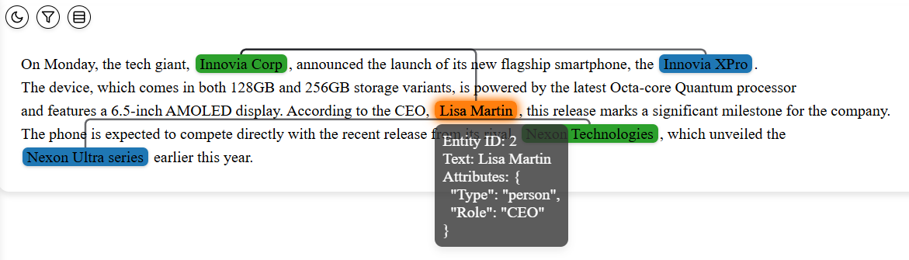

<div align="center"></div>


Visualization tool for NLP information extraction: Named entity recognition, Entity attribute extraction, and Relation extration.

## Table of Contents
- [Overview](#overview)
- [Prerequisite](#prerequisite)
- [Installation](#installation)
- [Quick Start](#quick-start)
- [Examples](#examples)
- [User Guide](#user-guide)

## Overview
The **ie-viz** is a lightweight tool for in-line information extraction (IE) visualization. It supports customizable colors for named entity marking, tooltip for entity attributes display, and relation path that links related named entities. Current version has built-in light and dark themes while customization is available through the CSS. The **ie-viz** can be deployed as a Flask App that runs on a host:port. It can also be rendered as HTML and display in Browser or Interactive Python environments (e.g., Jupyter Notebook). 

| Features | Support |
|----------|----------|
| **Named Entity Marks** | :white_check_mark: with customizable colors and table view |
| **Entity Attributes** | :white_check_mark: as tooltip and table view |
| **Entity Relations** | :white_check_mark: as path linking entities and table view |
| **Filtering**| :white_check_mark: by entity types |
| **Theme** | :white_check_mark: light and dark themes |
| **Deployment** | :white_check_mark: Flask APP or HTML rendering |

The filtering feature supports OR and AND logic for all available entity attributes. The table panel (collapsible) displays the selected entities, attributes, and relations.  
<p align="center">
  
  
</p>

## Prerequisite
- python ^3.11
- flask >=2.3

## Installation
Python package is available on PyPi.
```cmd
pip install ie-viz
```

## Quick-start
We use a short sample News article synthesized by GPT-4o to demo this quick-start.

```Python
text = """
On Monday, the tech giant, Innovia Corp, announced the launch of its new flagship smartphone, the Innovia XPro. 
The device, which comes in both 128GB and 256GB storage variants, is powered by the latest Octa-core Quantum processor 
and features a 6.5-inch AMOLED display. According to the CEO, Lisa Martin, this release marks a significant milestone for the company. 
The phone is expected to compete directly with the recent release from its rival, Nexon Technologies, which unveiled the 
Nexon Ultra series earlier this year.
"""
```

Entities have attribute **type** as one of "organization", "person", or "product". 
- when **type** is *organization*, there is no other attributes
- when **type** is *person*, the entity has an optional *Role* attribute
- when **type** is *product*, the entity has an optional *Specifications* attribute

```python
entities = [
            {'entity_id': '0', 'start': 28, 'end': 40, 'attr': {'Type': 'organization'}}, 
            {'entity_id': '1', 'start': 99, 'end': 111, 'attr': {'Type': 'product', 'Specifications': '128GB, 256GB, Octa-core Quantum processor, 6.5-inch AMOLED display'}}, 
            {'entity_id': '2', 'start': 296, 'end': 307, 'attr': {'Type': 'person', 'Role': 'CEO'}}, 
            {'entity_id': '3', 'start': 452, 'end': 470, 'attr': {'Type': 'organization'}}, 
            {'entity_id': '4', 'start': 492, 'end': 510, 'attr': {'Type': 'product'}}
           ]
```

Relations (optional) are listed as as entity id pairs.
```python
relations = [
             {'entity_1_id': '0', 'entity_2_id': '1'}, 
             {'entity_1_id': '0', 'entity_2_id': '2'}, 
             {'entity_1_id': '3', 'entity_2_id': '4'}
            ]
```

The `serve()` function starts a Flask App that visualizes the entities, attributes, and relations. The `theme` parameter supports light and dark modes. The `color_attr_key` parameter specifies that entity color is based on entity "Type" attribute. 
```python
from ie_viz import serve

serve(text, entities, relations, theme="light", color_attr_key="Type")
```

A Flask App starts on the localhost port 5000 (default). The full rendered HTML is available [TechNews](demo/TechNews.html)
```cmd
* Serving Flask app 'ie_viz.utilities'
 * Debug mode: off
WARNING: This is a development server. Do not use it in a production deployment. Use a production WSGI server instead.
 * Running on all addresses (0.0.0.0)
 * Running on http://127.0.0.1:5000
Press CTRL+C to quit
127.0.0.1 - - [02/Oct/2024 11:44:58] "GET / HTTP/1.1" 200 -
```

<div align="left"></div>

## Examples

Below are Jupyter notebooks that demo some use cases:

[Tech News: Organization, Product, and Person](demo/TechNews.ipynb)

[Clinical Note: Medication, condition, and Adverse Reaction](demo/ClinicalNote.ipynb)

## User guide

<details>
<summary> Input formats </summary>

Both the `serve()` and `render()` functions accept the same data types for input. 

The entities must be a list of dictionaries. Each dictionary must have `entity_id`, `start`, and `end` keys. The `attr` key is optional and can be used for entity attributes display or entity coloring. 
```python
entities = [
            {'entity_id': '<entity id>', 'start': <start char>, 'end': <end char>}, 
            {'entity_id': '<entity id>', 'start': <start char>, 'end': <end char>, 'attr': {'<attribute key>': '<attribute value>'}},
            ...
           ]
```

The relations is optional. It must be a list of dictionaries with `entity_1_id` and `entity_2_id` keys. 
```python
relations = [
             {'entity_1_id': '<entity id>', 'entity_2_id': '<entity id>'}, 
             {'entity_1_id': '<entity id>', 'entity_2_id': '<entity id>'}, 
             ...
            ]
```

</details>

<details>
<summary> Entity colors </summary>

There are two parameters to customize the entity colors, `color_attr_key` or `color_map_func`. If none of them are defined, a default color is assigned to all entities. 

The `color_attr_key` is a easier way to define entity color. It specifies an attribute key to be used. All entities with the same attribute value will be assigned the same color. 

```python
from ie_viz import serve

serve(text, entities, color_attr_key="<attribute key to assign color>")
```

Note that all entities must have that attribute key, or an error will be raised.

The `color_map_func` is a more flexible way to define colors. Users define a custom function that inputs an entity and returns a default color name or a hex color code (as string). 

```python 
def color_map_func(entity) -> str:
    if entity['attr']['<attribute key>'] == "<a certain value>":
        return "gray"
    else:
        return "#03A9F4"

serve(text, entities, color_map_func=color_map_func)
```
Note that the `color_map_func` has higher priority than `color_attr_key`. When provided, the `color_attr_key` will be overwritten.

</details>